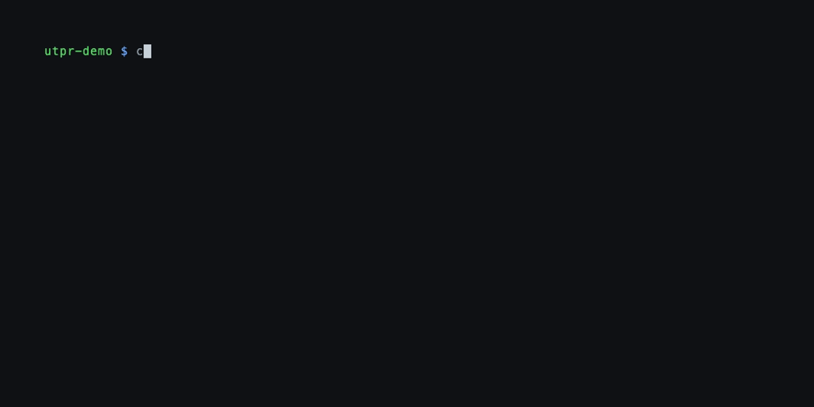

# utpr

A command-line tool for pull request workflows, inspired by the
[`pr_*()` helper functions][usethis-pr] from the R [usethis] package.

<p align="center"></p>

## Why utpr?

Working with pull requests involves a surprising amount of repetitive,
error-prone Git and GitHub ceremony: creating branches, configuring
remotes, fetching contributor forks, pushing and opening PRs, cleaning up
after merges. The [usethis] R package solved this beautifully with its
[`pr_*()` functions][usethis-pr], which abstract the entire PR lifecycle
into simple, memorable commands.

**utpr brings that same workflow to any terminal** — no R required.
It wraps `git` and the GitHub API to provide a polished, interactive
experience for the full pull request round-trip:

- **Start work** with `utpr init`, which creates a branch from a
  freshly-pulled default branch.
- **Switch context** freely with `utpr pause` and `utpr resume`.
- **Push and create PRs** with `utpr push`, which handles first-push
  setup and subsequent updates.
- **Review others' PRs** with `utpr fetch`, which configures remotes
  and tracking branches automatically — even for fork-based PRs.
- **Stay up to date** with `utpr pull` and `utpr merge-main`.
- **Monitor CI** with `utpr ci`, which shows GitHub Actions check status
  and streams failed-job logs right in your terminal.
- **Clean up** with `utpr finish` after a merge, or `utpr forget`
  to abandon work. Use `utpr clean` to sweep the entire repo in one
  pass: finish merged PRs, prune stale remote-tracking refs, and remove
  dead remotes.
- **Track down bugs** with `utpr bisect`, an interactive wrapper
  around `git bisect`.
- **Isolate AI coding agents** with `--worktree` on `utpr init` and
  `utpr fetch`: each agent gets its own Git worktree, pre-wired with
  your project's shared config, and `utpr finish` tears it down cleanly
  when the PR is merged.

utpr automatically detects whether you own the repo or are working from
a fork, and configures remotes accordingly. It tracks which branches and
remotes it created, so cleanup is safe and thorough.

For more background on the workflow that inspired utpr, see
[Pull Request Flow with usethis][blog-pr-flow] and the
[usethis pull request helpers documentation][usethis-pr].

## Installation

### Quick install (macOS / Linux)

```bash
curl -fsSL https://raw.githubusercontent.com/gadenbuie/utpr/main/scripts/install.sh | bash
```

### Quick install (Windows PowerShell)

```powershell
powershell -ExecutionPolicy ByPass -c "irm https://raw.githubusercontent.com/gadenbuie/utpr/main/scripts/install.ps1 | iex"
```

### From source (requires Go 1.25+)

```bash
go install github.com/gadenbuie/utpr@latest
```

### Download a release

Pre-built binaries for macOS, Linux, and Windows are available on the
[releases page](https://github.com/gadenbuie/utpr/releases).
macOS releases are packaged as `.dmg` installers — open the file and
drag `utpr` to the `/usr/local/bin` shortcut inside. Linux and Windows
releases are `.tar.gz` archives; extract and place `utpr` somewhere on
your `PATH`.

### Shell completions

The install script automatically sets up tab completions for your shell.
For manual installation or other shells, run `utpr completion --help`.

### Prerequisites

utpr requires [git](https://git-scm.com) to be installed and available on
your `PATH`.

utpr also needs GitHub authentication. You have two options:

1. **GitHub CLI** (recommended): Install [gh](https://cli.github.com) and run
   `gh auth login`. utpr reads the stored token automatically — `gh` is not
   needed at runtime after initial setup.

2. **Environment variable**: Set `GITHUB_TOKEN` (or `GH_TOKEN`) with a
   [personal access token](https://github.com/settings/tokens).

## Usage

```
utpr <command> [options]
```

| Command | Description |
|---------|-------------|
| `utpr init <branch> [--worktree]` | Create a new PR branch, optionally in a worktree; `--yes` assumes setup defaults |
| `utpr pause` | Switch back to the default branch |
| `utpr resume [<branch>]` | Resume work on a PR branch; `--yes` assumes setup defaults |
| `utpr fetch [<pr>] [--worktree]` | Fetch a PR from GitHub, optionally into a worktree; `--yes` assumes setup defaults |
| `utpr push [--edit=...]` | Push branch and create/update PR; `--agent` emits plain results |
| `utpr pull` | Pull latest changes |
| `utpr merge-main` | Merge default branch into current branch |
| `utpr ci [<ref>]` | Show GitHub Actions status; `--agent` emits plain output; `--wait` blocks until done; `utpr ci logs` streams failed-job output |
| `utpr forget` | Abandon local PR branch |
| `utpr finish [<pr>]` | Clean up after a merged PR |
| `utpr clean` | Interactively clean up merged branches, stale remotes, and pruned refs |
| `utpr view [<pr>]` | View PR details and comments; `--agent` emits raw Markdown |
| `utpr bisect [<bad-ref>]` | Find the commit that introduced a bug |

Run `utpr <command> --help` for detailed usage of any command.

### Typical workflow

```bash
# Start a new feature
utpr init my-feature

# ... write code, commit changes ...

# Push and create a PR (interactive terminal prompts)
utpr push

# Check that CI passed
utpr ci

# ... address review feedback ...
utpr push

# Switch to something else
utpr pause

# Come back later
utpr resume my-feature

# Stay current with the default branch
utpr merge-main

# After the PR is merged
utpr finish
```

### Reviewing a PR

```bash
# Fetch a contributor's PR (interactive selection)
utpr fetch

# Or by number
utpr fetch 42

# View it in the browser
utpr view

# Print raw Markdown for an agent or other text-processing tool
utpr view --agent

# Done reviewing
utpr finish
```

### Monitoring CI

`utpr ci` shows the GitHub Actions check status for the current branch
without leaving the terminal — no need to open the browser just to see
whether your checks passed.

```bash
# Show check status for the current branch
utpr ci

# Show checks for a specific PR or branch
utpr ci 42
utpr ci @some-branch

# Poll until all checks finish (live status display)
utpr ci --watch

# Show unstyled check output for an agent
utpr ci --agent

# Wait for all checks, then exit 0 (pass) or 1 (fail) — useful in scripts
utpr ci --wait

# Exit 1 as soon as any check fails, without waiting for the rest
utpr ci --wait failed

# Open checks in the browser
utpr ci --web
```

When checks fail, `utpr ci logs` streams the output of failed jobs so
you can debug without leaving the terminal:

```bash
# Interactive picker — choose which failed job to inspect
utpr ci logs

# Show logs for all failed jobs at once
utpr ci logs --failed

# Show unstyled logs for an agent
utpr ci logs --failed --agent

# Filter to a specific job by name
utpr ci logs --job "test"
```

### Keeping a clean repo

`utpr clean` is an interactive housekeeping command that sweeps the
entire repo in one pass:

```bash
utpr clean
```

It walks through the following steps, prompting for confirmation at each:

1. **Finish merged PRs** — detects any local branches whose PRs have
   been merged and runs the full `utpr finish` cleanup for each.
2. **Prune remote-tracking refs** — removes stale refs for branches
   deleted on the remote (`git fetch --prune`).
3. **Delete stale local branches** — offers to delete local branches
   with no corresponding remote tracking ref.
4. **Remove dead remotes** — cleans up utpr-managed remotes that no
   longer have any local branches pointing to them.

### Working with worktrees

The `--worktree` flag on `utpr init` and `utpr fetch` creates a
[Git worktree][git-worktree] instead of checking out the branch in
your main repo. Each worktree is a fully independent working directory,
so you can have multiple branches active simultaneously without
disturbing your main checkout.

This is especially useful for **AI coding agents**: give each agent
its own isolated workspace, pre-configured with your project's shared
settings.

```bash
# Start a new branch in its own worktree
utpr init feat/add-auth --worktree --yes

# Fetch a contributor's PR into a worktree for parallel review
utpr fetch 42 --worktree --yes
```

Worktrees are created at `<parent>/<repo>.worktrees/<branch>/`.
utpr automatically:

- Symlinks shared directories (`.claude`, `_dev`) into each worktree
- Runs project setup when detected (`npm install`, `uv sync`, `make setup`)
- Opens the worktree in your current editor

`utpr finish` and `utpr forget` clean up worktrees automatically.
`utpr resume` detects when a branch has a worktree and offers to
navigate there instead of switching in the main repo.

List worktrees as JSON for agent or script consumption:

```bash
utpr worktree list --json
```

The symlinked files and directories are controlled by the `UTPR_SYMLINK_DIRS`
environment variable. The default covers common untracked project state:
`_dev`, `.claude`, `.env`, `.env.local`, `.Renviron`, `.Rprofile`, `.agents`,
`.secrets`, `secrets`, `.htpasswd`, `.vscode`, `.vscode/settings.json`.

Items are only offered for symlinking if they exist in the main repo **and**
are not already present in the worktree (i.e. not tracked by git). Gitignored
files are naturally included since git never checks them out.

## Configuration

utpr can be configured with the following environment variables:

| Variable | Default | Description |
|----------|---------|-------------|
| `UTPR_EDITOR` | auto-detected | Editor command used to open worktrees (e.g. `code`, `cursor`, `zed`) |
| `UTPR_SYMLINK_DIRS` | `_dev,.claude,...` | Comma-separated list of files/dirs to symlink into new worktrees |

Set these in your shell profile (e.g. `~/.zshrc`):

```bash
export UTPR_EDITOR="cursor"
export UTPR_SYMLINK_DIRS="_dev,.claude,.env,.Renviron,secrets"
```

## Troubleshooting

### `utpr: command not found` after installation

If you installed with `go install`, make sure `$GOPATH/bin` (or `$GOBIN`)
is in your `PATH`:

```bash
echo $PATH | tr ':' '\n' | grep go
```

If missing, add it to your shell profile:

```bash
# ~/.zshrc or ~/.bashrc
export PATH="$(go env GOPATH)/bin:$PATH"
```

Then reload your shell (`source ~/.zshrc`) or open a new terminal.

### GitHub API errors or authentication failures

utpr reads GitHub authentication from the `gh` CLI config or from the
`GITHUB_TOKEN`/`GH_TOKEN` environment variable. If you see errors like
"authentication required" or "HTTP 401":

```bash
# Option 1: Use gh CLI for auth
gh auth login
gh auth status   # verify current auth

# Option 2: Set a token directly
export GITHUB_TOKEN="ghp_your_token_here"
```

If you have multiple GitHub accounts with `gh`, make sure the correct one is
active:

```bash
gh auth switch
```

## Acknowledgments

utpr is a standalone reimplementation of the
[pull request helpers][usethis-pr] from [usethis], an R package by
[Hadley Wickham][hadley], [Jennifer Bryan][jennybc], [Malcolm
Barrett][malcolm], and the [tidyverse team][tidyverse]. The
usethis PR functions made collaborative GitHub workflows delightful
for R developers — utpr aims to bring that same experience to any
project, in any language.

For a detailed walkthrough of the workflow, see
[Pull Request Flow with usethis][blog-pr-flow] by [Garrick
Aden-Buie][garrick].

## License

MIT

[git-worktree]: https://git-scm.com/docs/git-worktree
[usethis]: https://usethis.r-lib.org
[usethis-pr]: https://usethis.r-lib.org/articles/pr-functions.html
[blog-pr-flow]: https://www.garrickadenbuie.com/blog/pull-request-flow-usethis/
[hadley]: https://github.com/hadley
[jennybc]: https://github.com/jennybc
[malcolm]: https://github.com/malcolmbarrett
[tidyverse]: https://github.com/tidyverse
[garrick]: https://github.com/gadenbuie
